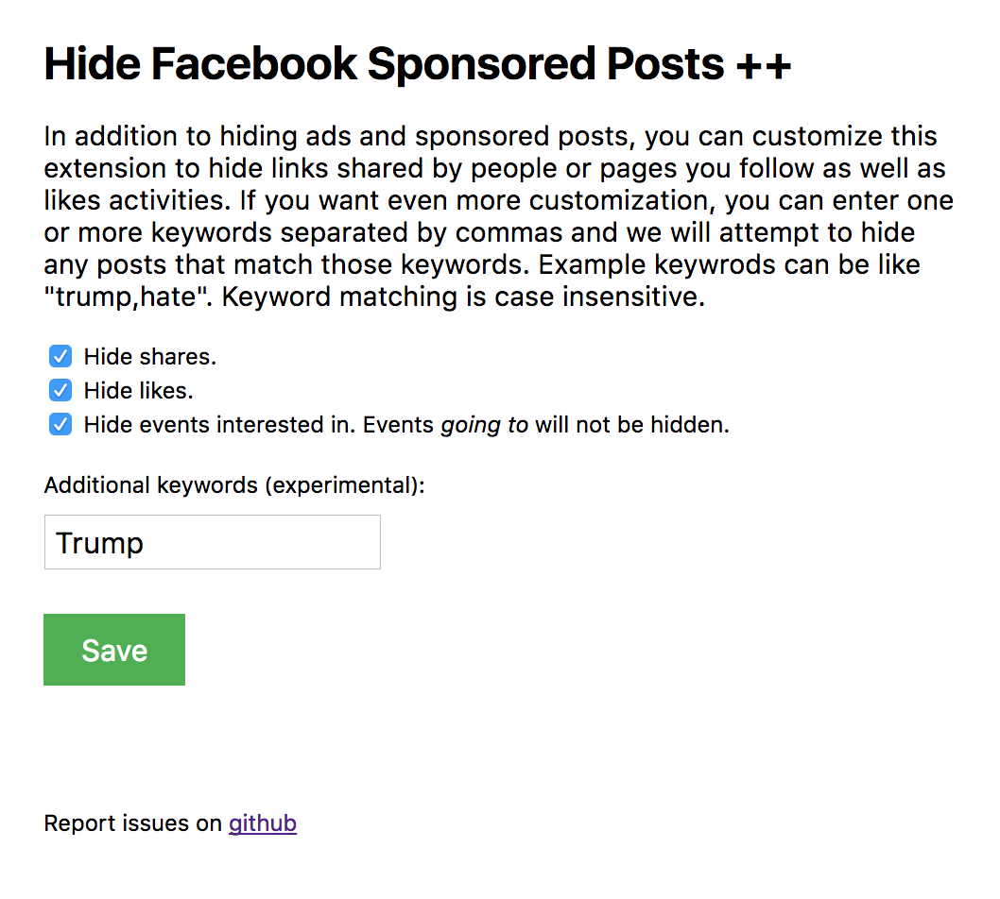

Hide Facebook Sponsored Posts
=============================

**[Chrome extension](https://chrome.google.com/webstore/detail/ogacbihneknbgjlkgnchagjnfhfpcflb)** for removing unsolicited content from the Facebook News Feed.

Once installed, sponsored and suggested posts (typically ads or promoted pages) will be removed from your news feed.

Options
-------

The extension provides options to also hide content that fall in the categories listed below.

The thinking behind these additional features is that we want to enable you to take even more more control of what you see in your feed. We take the point of view that this means seeing actual conversations your friends are having on Facebook. Posts people are making where they write something, photos being posted, comments fall in the category of _actual conversations_. The notifications feature in facebook is a great way to find out when someone likes content _you_ or tags you in something they shared. These are part of actual conversation mechnisms we want to continue to use, and the options below do not interfere with notifications.

* Likes
* Shares
* Events interested in (events going to will be shown)
* Posts that match certain keyworkds you don't care to see on your feed (e.g. Trump)

Liking something on facebook indicates an interest someone has on something. Facebook assumes you are interested in everything your friends like and tries to show you this information. When there are many likes, it uses algorithms to determine which of the many likes from friends you may be interested in, and shows you those. This is essentially a form of advertising to create a network effect. We give you the option to turn this off.

Sharing on facebook is a lightweight form on conversation. Often people just share without saying anything about what they are sharing. This, depending on your friends can get really boring and annoying and more importantly take away the opportunity for real conversations between people. We give you the option to remove shared content from your feed. Enable this if you think you are only interested in if a friend explicitly asks you to view some shared content. If they tag you, the content will appear in your notifications and you can see it through that.

Events are a unique case. We've recently seen an increase in the number of events people show interest in. The number of events people actually commit to attending and then follow through are far fewer. The option to hide interested events will cut down the noise in your feed and only show you events your friend say they will be _going to_. We hope this feature will increase the odds that you will see something you also want to go to and meet your friends.

They keyword matching feature is experimental. It will remove any posts where the content matches at least one of the given keywords. We'd love to hear your feedback on this.

Improvements
------------

A few things we want to improve that are outstanding at the moment,

* Don't hide shared memories. These are fun and is one reason we want to keep using facebook.

[@skidding](https://twitter.com/skidding)
